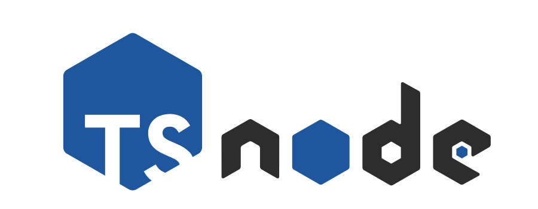

<!-- PROJECT LOGO -->
<br />
<p align="center">
  <a href="https://github.com/github_username/repo">
    
  </a>

  <h3 align="center">Nodejs-Typescript/Express/MongoDB Boilerplate</h3>

  <p align="center">
    A 👨🏻‍💻 Node-Typescript/Express/MongoDB Boilerplate with User Authentication and Authorization with JWT support.<br />
    This is an updated version of Sam Quinn's bulletproof-nodejs implementation<a href="https://github.com/santiq/bulletproof-nodejs"> LINK TO REPO </a>
    <br />
    <br />
    ·
    <a href="https://github.com/smithg09/nodejs-typescript-mongo-starter/issues/new?title=Report%20Bug">📝 Bug Report</a>
    ·
    <a href="https://github.com/smithg09/nodejs-typescript-mongo-starter/issues/new?title=Feature%20Request">📢 Feature Request</a>
  </p>
<p align="center">
<a href="https://github.com/smithg09/nodejs-typescript-mongo-starter/blob/master/LICENSE">
    
</a>
<a href="https://github.com/smithg09/nodejs-typescript-mongo-starter/issues">
    
</a>
<a href="#">
    
</a>
</p>
</p>

## TechStack


* [Node.js][https://nodejs.org/en/], [TypeScript][https://www.typescriptlang.org/] , [JWT][https://jwt.io/], [Prettier][https://prettier.io/] — core platform and dev tools
<!-- * [GraphQL.js][gqljs], [GraphQL.js Relay][gqlrelay], [DataLoader][loader], [validator][validator] — [GraphQL][gql] schema and API endpoint -->
* [MongoDB][https://www.mongodb.com/] — data access and db automation
* [Jest][jest] - unit and snapshot testing


## Development

We use `node` version `10.15.0`

```
nvm install 10.15.0
```

```
nvm use 10.15.0
```

The first time, you will need to run

```
npm install
```

Then just start the server with 

```
npm run start
```
It uses nodemon for livereloading :peace-fingers:


# Roadmap
- [x] Typescript class based implementation.
- [ ] Add GraphQL Support.
- [ ] CRUD Operations.
- [ ] Unit tests.


<!-- CONTRIBUTING -->
## Contributing

Contributions are what make the open source community such an amazing place to be learn, inspire, and create. Any contributions you make are **greatly appreciated**.

1. Fork the Project
2. Create your Feature Branch (`git checkout -b feature/AmazingFeature`)
3. Commit your Changes (`git commit -m 'Add some AmazingFeature'`)
4. Push to the Branch (`git push origin feature/AmazingFeature`)
5. Open a Pull Request

<!-- LICENSE -->
## License

Distributed under the MIT License. See `LICENSE` for more information.